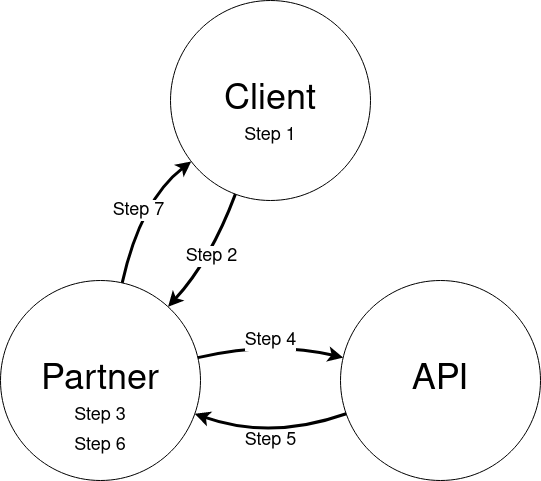

# Client-side Direct API Usage

The usual way of making an authenticated request to the SnapTrade API is to sign the request using the consumer key provided at sign up, storing the signature in the Signature header. However, since the signature-based authentication requires requests to be made from a backend server (so that the consumer key remains a secret), it might not be suitable for certain use cases.

In particular, some apps want their users to be able to talk to the SnapTrade API directly, so that user data does not pass through the app's server backend. This model can reduce development time on behalf of the app, reduce liability associated with having access to sensitive user data, and improve performance by removing the need for the app's server to intermediate all communication with the SnapTrade API.

We refer to this model as "client-side direct API", in which client-side code makes direct requests to SnapTrade's API on behalf of a registered user. This is implemented by allowing partners to obtain encrypted access tokens which would be decrypted and stored in a user's local device. The user's device then makes requests to the SnapTrade API using the decrypted access token. This approach uses public key cryptography to securely pass the access token to the user and prevent even partners from receiving the decrypted token.

## Communication Flow

There are three main parties involved in this communication pattern:

- The user running a client-side application on their personal device -- "The Client"
- The partner company running an authentication backend on their server that allows the user to login and controls access to the application's features -- "The Partner"
- The SnapTrade API that facilitates access to the user's brokerage account data -- "The API"

In addition, there is also the SnapTrade Connection Portal ("The Portal") which is a hosted web application that The Client must visit in order to connect accounts or modify their existing connections.

The following three sections describe the communication patter for registering a new user, generating a link to the SnapTrade Connection Portal so that The Client can connect accounts, and generating a client-side access token so that The Client can communicate directly with The API to access account information and trade. Once The Client has received its access token, The Partner will not need to intermediate requests to The API until a new access token is required.

To better understand the process, you can follow along each of the steps with the visual diagram that is provided for each process.

### Registration

The typical flow for registering a new user for client-side direct API usage is as follows:

1. The Client generates an RSA public/private keypair and stores it locally. Important: the private key MUST be kept locally on the client device! This is what's used for decrypting access tokens for The API.
1. The Client sends a message to The Partner indicating that it would like to register with SnapTrade. This message includes The Client's public RSA key that was generated in the previous step (not the private key!).
1. The Partner authenticates the request and confirms that The Client has permission to register an account with SnapTrade.
1. The Partner sends a request to The API at the :api[Authentication_registerSnapTradeUser] endpoint, including the desired `userId` as well as the `rsaPublicKey`.
1. The API confirms the new user registration and responds to The Partner with the `userSecret`.
1. The Partner stores the `userSecret` to be associated with their client.
1. The Partner sends a message to The Client confirming the success.

